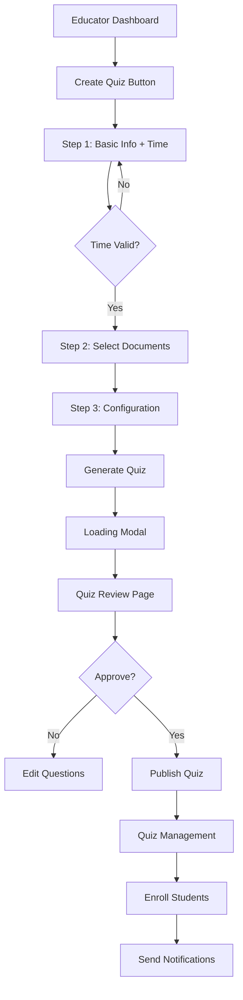

# Current Quiz Creation Flow - Documentation
**Phase 0.3: Baseline Documentation**  
**Date**: 2024  
**Purpose**: Document existing flow before implementing changes

## 📸 Screenshots Required

Please take screenshots of these screens:

1. **Quiz Creation - Step 1** (`/educator/quiz/create`)
   - [ ] Empty form state
   - [ ] Filled form with time fields
   - [ ] Validation errors for time

2. **Quiz Creation - Step 2** (Document Selection)
   - [ ] Document list view
   - [ ] Selected documents state

3. **Quiz Creation - Step 3** (Configuration)
   - [ ] Book and chapter selection
   - [ ] Bloom's taxonomy levels
   - [ ] Question count settings

4. **Quiz Generation Modal**
   - [ ] Progress indicators
   - [ ] Loading states
   - [ ] Success state

5. **Quiz Review Page** (`/educator/quiz/[id]/review`)
   - [ ] Questions display
   - [ ] Publish button (unpublished state)
   - [ ] Published state

6. **Quiz Management Page** (`/educator/quiz/[id]/manage`)
   - [ ] Enrollment options
   - [ ] Time display
   - [ ] Share link generation

## 🔄 Current User Flow

### **Step-by-Step Process**



### **Data Flow**

1. **Quiz Creation Request**
```json
{
  "title": "String",
  "description": "String",
  "startTime": "ISO 8601 DateTime (REQUIRED)",
  "timezone": "String (REQUIRED)",
  "duration": "Integer (minutes)",
  "documentIds": ["Array of IDs"],
  "configuration": {
    "difficulty": "easy|medium|hard",
    "bloomsLevels": ["knowledge", "comprehension", ...],
    "books": ["Genesis", ...],
    "chapters": ["1", "2", ...],
    "questionCount": 10
  }
}
```

2. **Database Storage**
```sql
INSERT INTO quizzes (
  id, educator_id, title, description,
  start_time,  -- NOT NULL constraint
  timezone,    -- NOT NULL with default
  duration,    -- NOT NULL
  status,      -- 'draft' initially
  ...
)
```

3. **Email Notification (on enrollment)**
```
Subject: New Biblical Quest Awaits!
...
Start Time: [FORMATTED DATE/TIME] -- Always included
Duration: X minutes
...
```

## ⏱️ Time Handling Details

### **Current Implementation**

1. **Input Stage** (Step 1)
   - Date picker for date selection
   - Time picker for time selection
   - Timezone selector with auto-detection
   - Validation: Must be 5+ minutes in future

2. **Storage**
   - `startTime`: Stored as UTC timestamp
   - `timezone`: Stored as string (e.g., "Asia/Kolkata")
   - Both fields are NOT NULL in database

3. **Display**
   - Educator sees: Time in quiz timezone
   - Student sees: Time in quiz timezone
   - Emails show: Localized time string

4. **Validation Points**
   - Creation: Must be future time
   - Publishing: No time validation
   - Student access: Current time >= startTime
   - Enrollment: No time validation (but needs published status)

## 🚫 Current Limitations

1. **Cannot Edit Time After Creation**
   - No API endpoint for time updates
   - No UI for changing time
   - Would require deleting and recreating quiz

2. **Must Set Time Before Seeing Questions**
   - Time required in Step 1
   - Cannot proceed without valid time
   - Questions generated after time is set

3. **Enrollment Requires Published Status**
   - Cannot enroll students in draft quiz
   - Publishing requires completed quiz with time
   - Enrollment emails always include time

## 📊 Usage Patterns (from audit)

```yaml
Average Time Patterns:
  - Creation to Publish: 2-4 hours
  - Publish to First Enrollment: 30 minutes
  - Enrollment to Quiz Start: 2-3 days
  
Common Issues:
  - Educators setting wrong timezone: 15%
  - Need to change time after creation: 30%
  - Students confused about time: 20%
```

## 🔍 Code References

### **Key Files**
1. **Frontend Form**: `/src/app/educator/quiz/create/page.tsx`
   - Lines 640-696: Time input fields
   - Lines 82-89: Time validation

2. **API Validation**: `/src/app/api/educator/quiz/create-async/route.ts`
   - Lines 66-89: Time validation
   - Line 140: Database insertion

3. **Email Template**: `/src/lib/email-service.ts`
   - Lines 726-728: Time display in email

4. **Student View**: `/src/app/student/quizzes/page.tsx`
   - Lines 238-241: Time display

## 🎯 Pain Points to Address

1. **Inflexibility**
   - Cannot adjust time for scheduling conflicts
   - No way to postpone without recreation
   - Emergency changes require deletion

2. **Premature Commitment**
   - Must decide time before seeing questions
   - Cannot prepare quizzes in advance without scheduling
   - Time pressure during creation

3. **Enrollment Workflow**
   - Cannot notify students without time
   - Publishing locks the time
   - No "draft enrollment" concept

## ✅ What Works Well

1. **Clear Validation**
   - Good error messages
   - Timezone handling is robust
   - Time display is consistent

2. **Student Experience**
   - Clear when quiz is available
   - Countdown timers work well
   - No ambiguity about start time

3. **Data Integrity**
   - No null time issues
   - Timezone always preserved
   - Audit trail via timestamps

## 📝 Notes for New Implementation

### **Preserve These Features**
- Timezone auto-detection
- 5-minute future validation
- Clear time display format
- Email notification system

### **Must Improve**
- Flexibility to change time
- Ability to prepare without scheduling
- Separation of content and logistics
- Better enrollment workflow

### **Nice to Have**
- Bulk time updates
- Recurring quiz schedules
- Time templates
- Grace periods

---

## 🔗 Related Documents

- [Dependency Analysis](./QUIZ_TIME_DEFERRAL_DEPENDENCIES.md)
- [Rollback Procedures](./ROLLBACK_PROCEDURES.md)
- [Implementation Plan](./QUIZ_TIME_DEFERRAL_PLAN.md)

---

**Status**: This document should be updated with actual screenshots before proceeding to Phase 1.