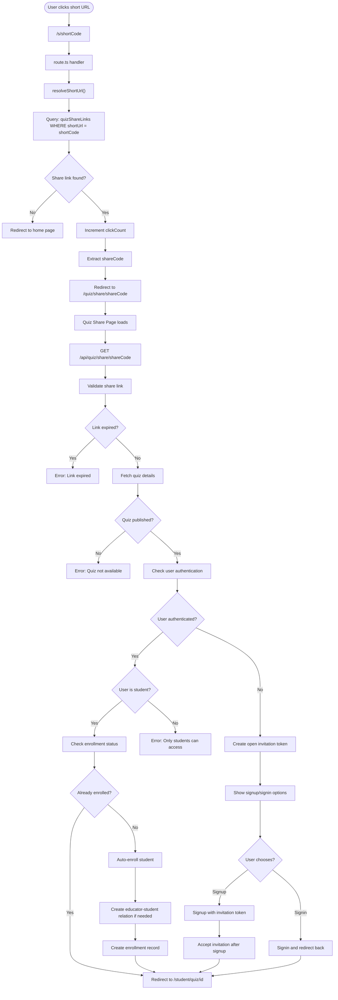
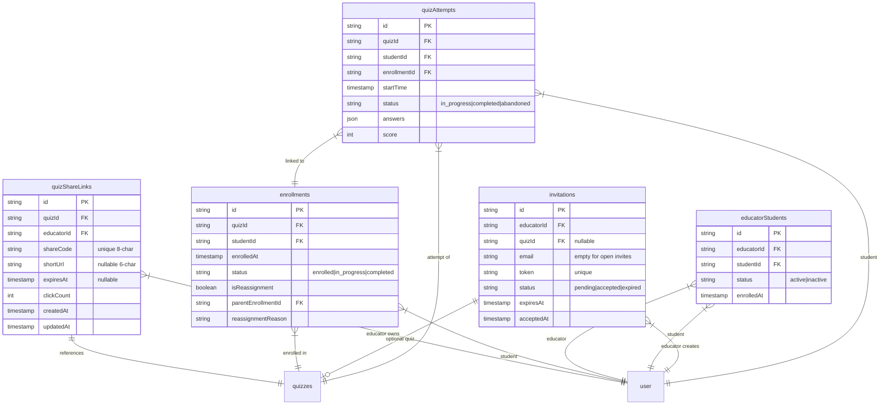

# Complete Investigation: Quiz Access via Short URL

## Executive Summary
This document provides a comprehensive analysis of the complete process flow when anyone accesses a quiz using a short URL. The investigation covers every step, validation, approval process, and data interaction from the initial URL click to quiz completion.

## Process Flow Overview



## Detailed Component Analysis

### 1. Short URL Resolution (`/src/app/s/[shortCode]/route.ts`)

**Purpose**: Resolves short URL to actual share code and redirects

**Process**:
```typescript
1. Extract shortCode from URL parameter
2. Call resolveShortUrl(shortCode)
3. Query database: SELECT * FROM quizShareLinks WHERE shortUrl = shortCode
4. If found:
   - Increment clickCount
   - Update updatedAt timestamp
   - Return shareCode
5. If not found: Redirect to home page
6. Redirect to /quiz/share/[shareCode] preserving query parameters
```

**Data Interactions**:
- **Read**: `quizShareLinks` table
- **Update**: `clickCount` and `updatedAt` fields
- **Tracking**: Click analytics for URL usage

### 2. Quiz Share Page (`/src/app/quiz/share/[shareCode]/page.tsx`)

**Purpose**: Landing page for quiz access via share link

**Process Flow**:
```typescript
1. Fetch quiz info via API
2. Display quiz details (title, duration, questions, educator)
3. Check authentication status
4. Handle three scenarios:
   a. Not authenticated → Show signup/signin options
   b. Authenticated but not enrolled → Auto-enroll
   c. Authenticated and enrolled → Direct to quiz
```

**User Interface States**:
- Loading state with biblical loader
- Error state with appropriate messaging
- Quiz info display with action buttons
- Authentication prompts with clear CTAs

### 3. Quiz Info API (`/src/app/api/quiz/share/[shareCode]/route.ts`)

**Purpose**: Validates share link and returns quiz information

**Validation Steps**:
```typescript
1. Find share link by shareCode
2. Check expiration: shareLink.expiresAt > now
3. Increment click count for analytics
4. Fetch quiz from database
5. Verify quiz.status === 'published'
6. Get educator information
7. Check user authentication
8. If authenticated:
   - Verify user.role === 'student'
   - Check enrollment status
   - Check educator-student relationship
9. If not authenticated:
   - Create open invitation token
   - Set 7-day expiration
   - Return token for signup flow
```

**Database Queries**:
```sql
-- Find share link
SELECT * FROM quiz_share_links WHERE share_code = ?

-- Get quiz details
SELECT * FROM quizzes WHERE id = ?

-- Get educator info
SELECT name, email FROM user WHERE id = ?

-- Check enrollment
SELECT * FROM enrollments 
WHERE quiz_id = ? AND student_id = ?

-- Check educator relationship
SELECT * FROM educator_students 
WHERE student_id = ? AND educator_id = ?

-- Create invitation
INSERT INTO invitations (id, educator_id, quiz_id, email, token, status, expires_at)
VALUES (?, ?, ?, '', ?, 'pending', ?)
```

### 4. Enrollment Process (`/src/app/api/quiz/share/[shareCode]/enroll/route.ts`)

**Purpose**: Enrolls authenticated student in quiz

**Validation & Process**:
```typescript
1. Require authenticated student session
2. Validate share link exists and not expired
3. Check quiz is published
4. Check existing enrollment
5. If not enrolled:
   a. Check educator-student relationship
   b. Create relationship if missing
   c. Create enrollment record
6. Return success with enrollmentId and quizId
```

**Database Operations**:
```sql
-- Check/Create educator-student relationship
INSERT INTO educator_students (id, educator_id, student_id, status, enrolled_at)
VALUES (?, ?, ?, 'active', NOW())

-- Create enrollment
INSERT INTO enrollments (id, quiz_id, student_id, enrolled_at, status)
VALUES (?, ?, ?, NOW(), 'enrolled')
```

### 5. Quiz Start Process (`/src/app/api/student/quiz/[id]/start/route.ts`)

**Purpose**: Initializes quiz attempt for enrolled student

**Complex Validation Logic**:
```typescript
1. Verify student authentication
2. Check quiz exists
3. Handle multiple enrollment scenarios:
   - Original enrollment
   - Reassignment enrollment
   - Auto-enrollment from share link
4. Check attempt status:
   - abandoned → Create new attempt
   - completed → Block access
   - in_progress → Resume attempt
5. Time validation (for non-reassignments):
   - Check quiz.startTime exists
   - Verify current time within quiz window
   - Calculate remaining time
6. Create new attempt:
   - Generate attemptId
   - Shuffle questions if needed
   - Store in database
   - Cache for performance
```

**Enrollment Priority Logic**:
```typescript
// Find active enrollment (latest non-completed)
for (const enrollment of allEnrollments) {
  if (enrollment.status === "completed") {
    if (!enrollment.isReassignment) hasCompletedOriginal = true;
  } else if (!activeEnrollment) {
    activeEnrollment = enrollment; // First non-completed
  }
}
```

### 6. Authentication Flow for New Users

**Signup with Invitation Token**:
```typescript
1. User clicks "Sign Up & Start Quiz"
2. Redirect to /auth/signup?invitation=TOKEN
3. Signup page validates token
4. Pre-fills email if token is email-specific
5. After signup:
   - Accept invitation automatically
   - Create educator-student relationship
   - Create enrollment if quiz-specific
   - Redirect to quiz
```

**Invitation Acceptance (`/src/app/api/invitations/accept/route.ts`)**:
```typescript
1. Validate token is pending and not expired
2. Get or create student ID
3. Create educator-student relationship
4. If quiz-specific: Create enrollment
5. Mark invitation as accepted
6. Return success with educatorId and quizId
```

## Database Schema Relationships



## Access Control Matrix

| User State | Share Link Valid | Quiz Published | Result |
|------------|------------------|----------------|--------|
| Not authenticated | ✓ | ✓ | Show signup/signin options with invitation token |
| Not authenticated | ✓ | ✗ | Error: Quiz not available |
| Not authenticated | ✗ | - | Redirect to home |
| Student authenticated | ✓ | ✓ | Check enrollment → Auto-enroll if needed → Start quiz |
| Student authenticated | ✓ | ✗ | Error: Quiz not available |
| Non-student authenticated | ✓ | ✓ | Error: Only students can access |
| Any | Expired | - | Error: Link expired |

## Time-Based Access Control

### Regular Enrollment
```typescript
if (!enrollment.isReassignment) {
  // Check scheduled time
  if (!quiz.startTime) → Error: Not scheduled
  if (now < quiz.startTime) → Error: Not started (show countdown)
  if (now > quiz.endTime) → Error: Quiz ended
}
```

### Reassignment Enrollment
- No time constraints
- Can start anytime after reassignment
- Questions always shuffled

## Security Considerations

### 1. Share Link Security
- **8-character share code**: ~47 bits entropy
- **6-character short URL**: Sufficient for convenience
- **Collision detection**: Retry logic for uniqueness
- **Click tracking**: Analytics without PII

### 2. Enrollment Security
- Auto-enrollment only for published quizzes
- Educator-student relationship auto-created
- Enrollment linked to specific share access
- Prevents duplicate enrollments

### 3. Invitation Security
- Cryptographically secure token generation (32 bytes)
- 7-day expiration for security
- Open invitations (empty email) for share links
- One-time use (marked as accepted)

### 4. Session Security
- Authentication required for quiz attempt
- Role verification (student-only access)
- Session management with auto-extend
- Timeout handling for quiz submission

## Performance Optimizations

### 1. Database Optimizations
- Indexed columns: shareCode, shortUrl, quizId, studentId
- Efficient queries with proper WHERE clauses
- Relationship checks optimized with LIMIT 1

### 2. Caching Strategy
```typescript
// Quiz data caching
await quizCache.cacheQuizData(quizId, quizData);

// Enrollment status caching
await quizCache.cacheEnrollment(studentId, quizId, true);

// Attempt tracking
await quizCache.trackAttempt(attemptId, attemptData);
```

### 3. Lazy Loading
- Short URLs generated only when needed
- Invitation tokens created on-demand
- Questions loaded only at quiz start

## Error Handling & User Experience

### Error States with Clear Messaging
1. **Invalid Link**: "Invalid share link" → Redirect home
2. **Expired Link**: "This share link has expired" → Show expiry message
3. **Quiz Not Published**: "Quiz not available" → Educator action needed
4. **Not a Student**: "Only students can access quiz through share links"
5. **Quiz Not Started**: Shows countdown with exact time
6. **Quiz Ended**: "This quiz has already ended"
7. **Already Completed**: "You have already completed this quiz"

### Recovery Mechanisms
1. **Session Recovery**: Resume in-progress attempts
2. **Auto-Save**: Periodic answer saving
3. **Offline Support**: Local storage for answers
4. **Network Resilience**: Retry logic for API calls

## Monitoring & Analytics

### Tracked Metrics
```typescript
// Share link metrics
- clickCount: Incremented on each access
- updatedAt: Last access timestamp
- Unique visitors vs total clicks

// Enrollment metrics
- Auto-enrollment rate
- Share link conversion
- Time from share to completion

// Performance metrics
- Page load times
- API response times
- Quiz completion rates
```

## Summary

The short URL quiz access system implements a sophisticated multi-layered approach:

1. **Accessibility**: Open to anyone with the link
2. **Security**: Proper validation at every step
3. **Flexibility**: Handles authenticated and unauthenticated users
4. **Performance**: Optimized with caching and lazy loading
5. **User Experience**: Clear messaging and smooth flows
6. **Analytics**: Comprehensive tracking for insights

The system successfully balances ease of access with security requirements, allowing educators to share quizzes widely while maintaining control and tracking usage.